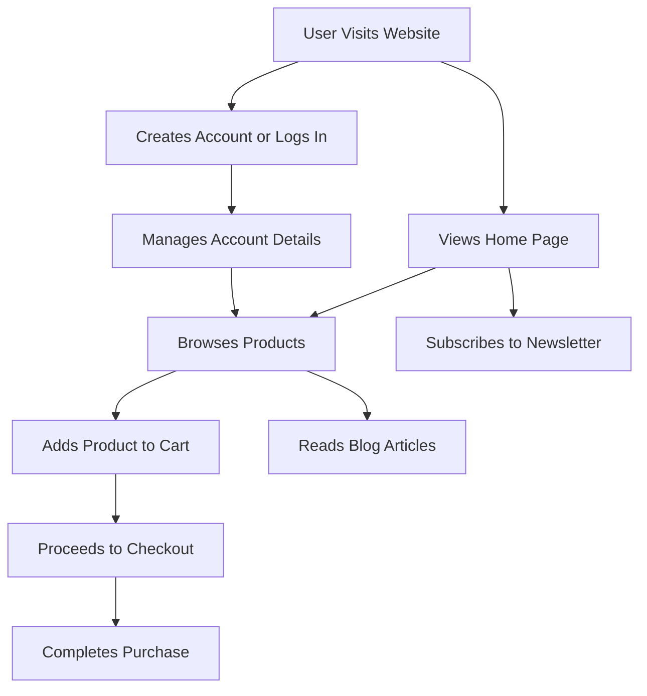

# Evara E-commerce Website

## Overview
The **Evara E-commerce Website** is a responsive, modern online store template designed to provide users with a seamless shopping experience. Built using **HTML, CSS, and JavaScript**, this frontend project offers various features and layouts suitable for diverse product categories. 

🔗 **Live Demo:** [Evara E-commerce Website](https://e-commerce-evara.vercel.app/)

---

## Features

### 🖥️ Responsive Design
- Ensures optimal viewing across devices, including **desktops, tablets, and smartphones**.

### 🏡 Multiple Home Page Layouts
- Offers different homepage designs, such as:
  - **Clean**
  - **Collection**
  - **Minimal**
  - **Modern**
  - **Parallax**
  - **Strong**
  - **Style**
  - **Unique**
  - **RTL (Right-to-Left)**

### 🛍️ Product Displays
- Showcases products with **images, names, ratings, and prices**.
- Highlights **discounts and special offers**.

### 🔎 Navigation and Search
- Provides a **comprehensive navigation menu** with categories like:
  - Women's Clothing
  - Men's Clothing
  - Cellphones
  - Computer & Office
  - Consumer Electronics
  - Home & Garden
  - Shoes
  - Mother & Kids
  - Outdoor Fun
- Includes a **search bar** for quick product discovery.

### 👤 User Account Management
- Users can **log in** or **sign up**.
- View **cart, wishlist, and track orders**.

### 📝 Blog Section
- Engages users with **articles and updates**.

### 📩 Newsletter Subscription
- Allows users to **subscribe** for exclusive deals and updates.

### 📌 Footer Information
- Displays **company information, customer service links, and social media icons**.

---

## Technologies Used
- **HTML5**: Structures the content and layout of the website.
- **CSS3**: Styles the website for a visually appealing and responsive design.
- **JavaScript**: Adds interactivity and dynamic features for an enhanced user experience.

---

## Installation & Setup
To set up the project locally:

### 🔹 Clone the Repository:
```sh
git clone https://github.com/your-username/evara-ecommerce.git
cd evara-ecommerce
```

### 🔹 Open the Project:
- Navigate to the project directory.
- Open `index.html` in your preferred **web browser**.

---

## System Workflow


---

## 📜 License
This project is **open-source** and available under the [MIT License](LICENSE).

🚀 Happy Coding! 🎉
